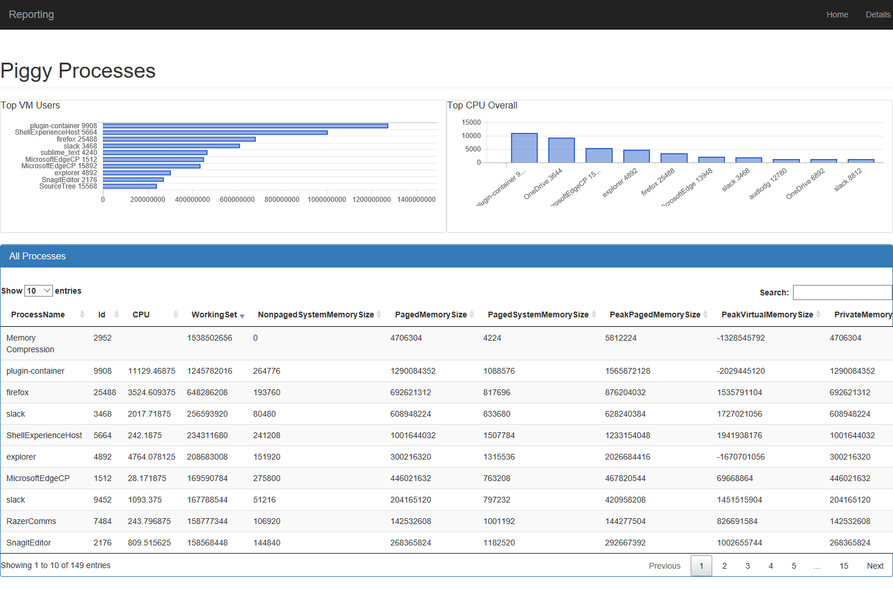

# HtmlReport
Making HTML reports with charts and tables, from templates, in PowerShell

Still in progress, but here's an example of a report:

```posh
$topVM = ps | Sort PrivateMemorySize -Descending |
              Select -First 10 | 
              ForEach { ,@(($_.ProcessName + " " + $_.Id), $_.PrivateMemorySize) }

$topCPU = ps | Sort CPU -Descending | 
               Select -First 10 | 
               ForEach { ,@(($_.ProcessName + " " + $_.Id), $_.CPU) }

New-Report -Title "Piggy Processes" -Input {
    New-Chart Bar "Top VM Users" -input $topVm
    New-Chart Column "Top CPU Overall" -input $topCPU
    ps | Select ProcessName, Id, CPU, WorkingSet, *MemorySize | New-Table "All Processes"
} > Report.html
```

